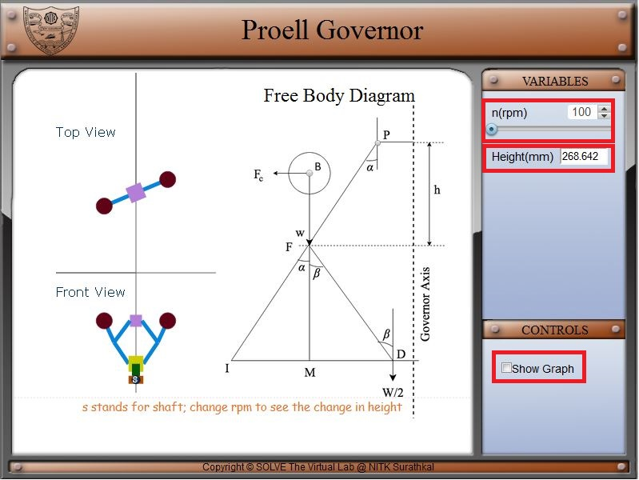

#### These procedure steps will be followed on the simulator

1. In simulation window front, top view and free-body diagram of Proell governor is displayed. 

2. Speed control pointer is given on top left of the screen, respective height is displayed below it and on the bottom left one checkbox for the graph is available. 
 

3. Move the slider knob to the right, this causes the rotational speed to change from 100 to 150 rpm. 
 

4. Change rotational speed from 100 to 150 rpm can be obtained by changing the arrow marks above the slider. 
 

5. When graph checkbox is checked, a graph and theoretical correlation is displayed. This graph shows the trend of governor height on varying the rotational speed of governor.  
 
